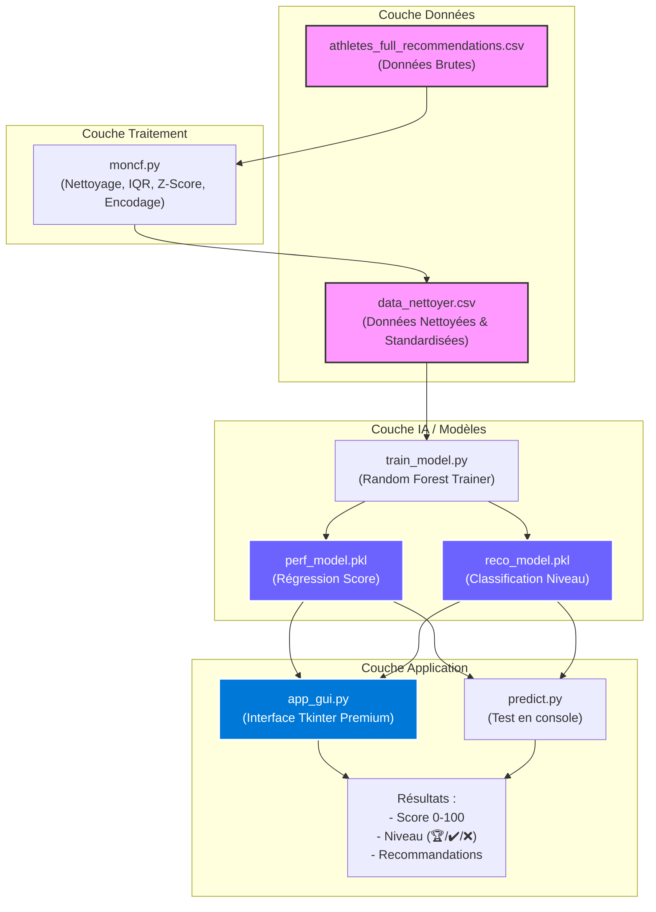

# 🏃 Optimisation des Performances Sportives

> Analyse de données biométriques par Machine Learning pour optimiser les performances des athlètes et fournir des recommandations personnalisées.

---

## 📋 Description du projet

Ce projet analyse les données biométriques collectées lors de séances sportives (fréquence cardiaque, accélération, fréquence de pas, gyroscope, etc.) afin de :

- **Comprendre** les facteurs influençant la performance sportive
- **Prédire** le score de performance d'un athlète
- **Classifier** son niveau (Insuffisant / Bon / Excellent)
- **Recommander** des ajustements personnalisés d'entraînement

---

## 🗂️ Structure du projet

```
project_python/
│
└── sport-performance-optimization/
    │
    ├── athletes_full_recommendations.csv   # Dataset brut (biométrie + recommandations)
    ├── data_nettoyer.csv                   # Dataset nettoyé et standardisé
    ├── moncf.py                            # Script de nettoyage des données
    ├── requirements.txt                    # Dépendances Python
    ├── README.md                           # Ce fichier
    │
    └── analyser_les_performances/
        ├── train_model.py                  # Entraînement des modèles ML
        ├── predict.py                      # Test de prédiction en ligne de commande
        ├── app_gui.py                      # Interface graphique (Tkinter)
        ├── perf_model.pkl                  # Modèle de régression (score 0–100)
        └── reco_model.pkl                  # Modèle de classification (niveau)
```

---

## 🏗️ Architecture du Système



---

## ⚙️ Pipeline de traitement

### Tâche 1 — Collecte et nettoyage des données (`moncf.py`)

Le script `moncf.py` applique les étapes suivantes sur `athletes_full_recommendations.csv` :

1. **Suppression des doublons**
2. **Conversion des types numériques** (`pd.to_numeric`)
3. **Détection des valeurs aberrantes** (méthode IQR + clipping)
4. **Gestion des valeurs manquantes** (imputation médiane, suppression si > 30% manquants)
5. **Standardisation Z-score** (moyenne = 0, écart-type = 1)
6. **Encodage des variables catégorielles** :
   - One-hot : `event_type`, `motion_class`
   - Ordinal : `risk_level`, `hr_zone`, `performance_level`

**Résultat :** `data_nettoyer.csv` — 10 000+ lignes, 32 colonnes

---

### Tâche 2 — Entraînement des modèles ML (`train_model.py`)

Utilise **21 features biométriques** issues de `data_nettoyer.csv` :

| Catégorie | Features |
|-----------|----------|
| Cardiaque | `heart_rate_bpm`, `hr_zone_encoded` |
| Cinématique | `step_frequency_hz`, `stride_length_m`, `acceleration_mps2` |
| Gyroscope | `gyroscope_x`, `gyroscope_y`, `gyroscope_z` |
| Accéléromètre | `accelerometer_x`, `accelerometer_y`, `accelerometer_z` |
| Signal | `signal_energy`, `dominant_freq_hz` |
| Type d'épreuve | `event_type_high_jump`, `event_type_long_jump`, `event_type_sprint` |
| Phase de mouvement | `motion_class_acceleration_phase`, `motion_class_flight_phase`, `motion_class_landing`, `motion_class_start_phase` |
| Risque | `risk_level_encoded` |

**Deux modèles Random Forest** entraînés et sauvegardés :

| Fichier | Type | Cible |
|---------|------|-------|
| `perf_model.pkl` | Régression | `performance_score` (0 à 100) |
| `reco_model.pkl` | Classification | Niveau (0=Insuffisante, 1=Bonne, 2=Excellente) |

---

### Tâche 3 — Test de prédiction (`predict.py`)

Charge les deux modèles et effectue une prédiction à partir de données biométriques.

**Exemple de résultat obtenu :**
```
Score de performance estimé : 74.14 / 100
Niveau de performance       : Excellente 🏆
```

---

### Tâche 4 — Interface graphique (`app_gui.py`)

Application de bureau **Tkinter** avec un design sombre et moderne :

- **Panneau gauche** : 21 champs biométriques en grille 2 colonnes, pré-remplis
- **Panneau droit** : score prédit, barre de progression colorée, niveau, recommandations personnalisées
- **Boutons** : `🚀 Analyser` et `↺ Réinitialiser`

Les recommandations s'adaptent automatiquement au niveau détecté :
- 🔴 **Insuffisante** → réduction du volume, récupération, technique
- 🟡 **Bonne** → progression progressive, cycle 3+1
- 🟢 **Excellente** → cross-training, variabilité, surveillance du surentraînement

---

## 🚀 Installation et utilisation

### 1. Installer les dépendances

```bash
pip install -r sport-performance-optimization/requirements.txt
```

### 2. Nettoyer les données

```bash
cd sport-performance-optimization
python moncf.py
```

### 3. Entraîner les modèles

```bash
python analyser_les_performances/train_model.py
```

### 4. (Optionnel) Tester les prédictions en console

```bash
python analyser_les_performances/predict.py
```

### 5. Lancer l'interface graphique

```bash
python analyser_les_performances/app_gui.py
```

---

## 🧰 Technologies utilisées

| Outil | Rôle |
|-------|------|
| **Python 3.x** | Langage principal |
| **pandas / numpy** | Manipulation et nettoyage des données |
| **scikit-learn** | Modèles ML (RandomForestRegressor, RandomForestClassifier) |
| **joblib** | Sauvegarde / chargement des modèles |
| **tkinter** | Interface graphique de bureau |

---

## 📊 À propos du dataset

`athletes_full_recommendations.csv` contient des enregistrements biométriques pour trois épreuves :

| Épreuve | Colonne |
|---------|---------|
| Sprint | `event_type_sprint` |
| Saut en hauteur | `event_type_high_jump` |
| Saut en longueur | `event_type_long_jump` |

Chaque enregistrement inclut un score de performance, un niveau de risque de blessure et des recommandations textuelles personnalisées.

---

## 👥 Équipe

- **Brahim EL BAHLOUL**
- **Yassine Mokrame**
- **Mounssif Saih**
- **Jaouad Nainiaa**
- **Bargaa Issa**

---

Projet réalisé dans le cadre d'un cours sur l'optimisation des performances sportives par intelligence artificielle.
