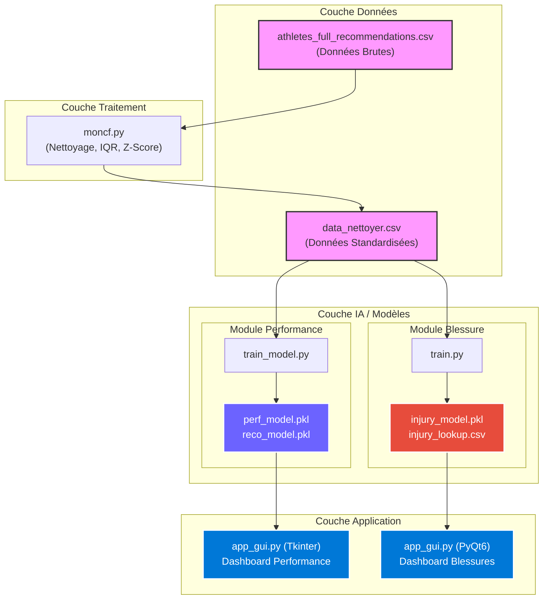

# 📉 Optimisation des Performances Sportives

> Analyse de données biométriques par Machine Learning pour optimiser les performances des athlètes et fournir des recommandations personnalisées.

---

##  Description du projet

Ce projet analyse les données biométriques collectées lors de séances sportives (fréquence cardiaque, accélération, fréquence de pas, gyroscope, etc.) afin de :

- **Comprendre** les facteurs influençant la performance sportive
- **Prédire** le score de performance d'un athlète
- **Classifier** son niveau (Insuffisant / Bon / Excellent)
- **Recommander** des ajustements personnalisés d'entraînement

---

##  Structure du projet

```
project_python/
│
└── sport-performance-optimization/
    │
    ├── athletes_full_recommendations.csv   # Dataset brut (biométrie + recommandations)
    ├── data_nettoyer.csv                   # Dataset nettoyé et standardisé
    ├── moncf.py                            # Script de nettoyage des données
    ├── main.py                             # Fichier d'entrée du projet
    ├── requirements.txt                    # Dépendances Python
    ├── README.md                           # Ce fichier
    │
    ├── analyser_les_performances/          # 🏆 Module de Prédiction des Performances
    │   ├── train_model.py                  # Entraînement des modèles ML (Performance)
    │   ├── predict.py                      # Test de prédiction en ligne de commande
    │   ├── app_gui.py                      # Interface graphique (Tkinter)
    │   ├── perf_model.pkl                  # Modèle de régression Score
    │   ├── reco_model.pkl                  # Modèle de classification Niveau
    │   └── performance_lookup.csv          # Classes vers texte de recommandation
    │
    └── analyser__blessure/                 # 🩺 Module de Prévention des Blessures
        ├── train_model.py ou train.py      # Entraînement du modèle ML (Blessure)
        ├── predict.py                      # Inférence (unitaire et batch)
        ├── app_gui.py                      # Dashboard graphique (PyQt6)
        ├── injury_model.pkl                # Modèle de régression logistique / XGBoost
        ├── injury_encoder.pkl              # Encodeur de la target (LabelEncoder)
        └── injury_lookup.csv               # Classes vers texte de recommandation
```

---

##  Architecture du Système



---

##  Pipeline de traitement

### Tâche 1 — Collecte et nettoyage des données (`moncf.py`)

Le script `moncf.py` applique les étapes suivantes sur `athletes_full_recommendations.csv` :

1. **Suppression des doublons**
2. **Conversion des types numériques** (`pd.to_numeric`)
3. **Détection des valeurs aberrantes** (méthode IQR + clipping)
4. **Gestion des valeurs manquantes** (imputation médiane, suppression si > 30% manquants)
5. **Standardisation Z-score** (moyenne = 0, écart-type = 1)
6. **Encodage des variables catégorielles** :
   - One-hot : `event_type`, `motion_class`
   - Ordinal : `risk_level`, `hr_zone`, `performance_level`

**Résultat :** `data_nettoyer.csv` — 10 000+ lignes, 32 colonnes

---

### Tâche 2 — Prédiction des Performances (`analyser_les_performances/`)

Entraînement de modèles de performance via **Random Forest** et **XGBoost** sur 21 variables.
Deux modèles générés :
- `perf_model.pkl` : Régression pour le score de performance (0-100).
- `reco_model.pkl` : Classification pour le niveau global.
L'interface `app_gui.py` (Tkinter) offre une vue sur les recommandations liées aux performances brutes.

---

### Tâche 3 — Prévention des Blessures (`analyser__blessure/`)

Génération de modèles de Machine Learning prédictifs avec stratégie **SMOTE** (pour traiter le déséquilibre des données) et paramétrage automatique (GridSearchCV).
- Utilise la régression logistique / XGBoost pour classifier précisément le texte descriptif des recommandations médicales/préventives selon la zone de rythme cardiaque, le risque et le type de saut/course.
- `app_gui.py` (PyQt6) lance un **Dashboard analytique poussé**, incluant jauges, graphiques Radar, importance des variables, et table d'historique.

---

### Tâche 4 — Interface Unifiée & Test CLI

Chaque module dispose de son app_gui mais également de `predict.py` pour lancer des requêtes depuis le terminal (inférence simple ou par batch un fichier csv entier).

---

##  Installation et utilisation

### 1. Installer les dépendances

```bash
pip install -r sport-performance-optimization/requirements.txt
```

### 2. Nettoyer les données

```bash
cd sport-performance-optimization
python moncf.py
```

### 3. Entraîner les modèles

```bash
python analyser_les_performances/train_model.py
```

### 4. (Optionnel) Tester les prédictions en console

```bash
python analyser_les_performances/predict.py
```

### 5. Lancer l'interface graphique

```bash
python analyser_les_performances/app_gui.py
```

---

##  Technologies utilisées

| Outil | Rôle |
|-------|------|
|  | Langage principal |
|  /  | Manipulation et nettoyage des données |
|  | Modèles ML (RandomForest, XGBoost, LogReg, SMOTE imblearn) |
|  | Sauvegarde / chargement des modèles |
|  | PyQt6 + Matplotlib pour le Dashboard Blessure ; Tkinter pour la performance |

---

##  À propos du dataset

`athletes_full_recommendations.csv` contient des enregistrements biométriques pour trois épreuves :

| Épreuve | Colonne |
|---------|---------|
| Sprint | `event_type_sprint` |
| Saut en hauteur | `event_type_high_jump` |
| Saut en longueur | `event_type_long_jump` |

Chaque enregistrement inclut un score de performance, un niveau de risque de blessure et des recommandations textuelles personnalisées.

---

##  Équipe

- **Brahim EL BAHLOUL**
- **Yassine Mokrame**
- **Mounssif Saih**
- **Jaouad Nainiaa**
- **Bargaa Issa**

---

Projet réalisé dans le cadre d'un cours sur l'optimisation des performances sportives par intelligence artificielle.
